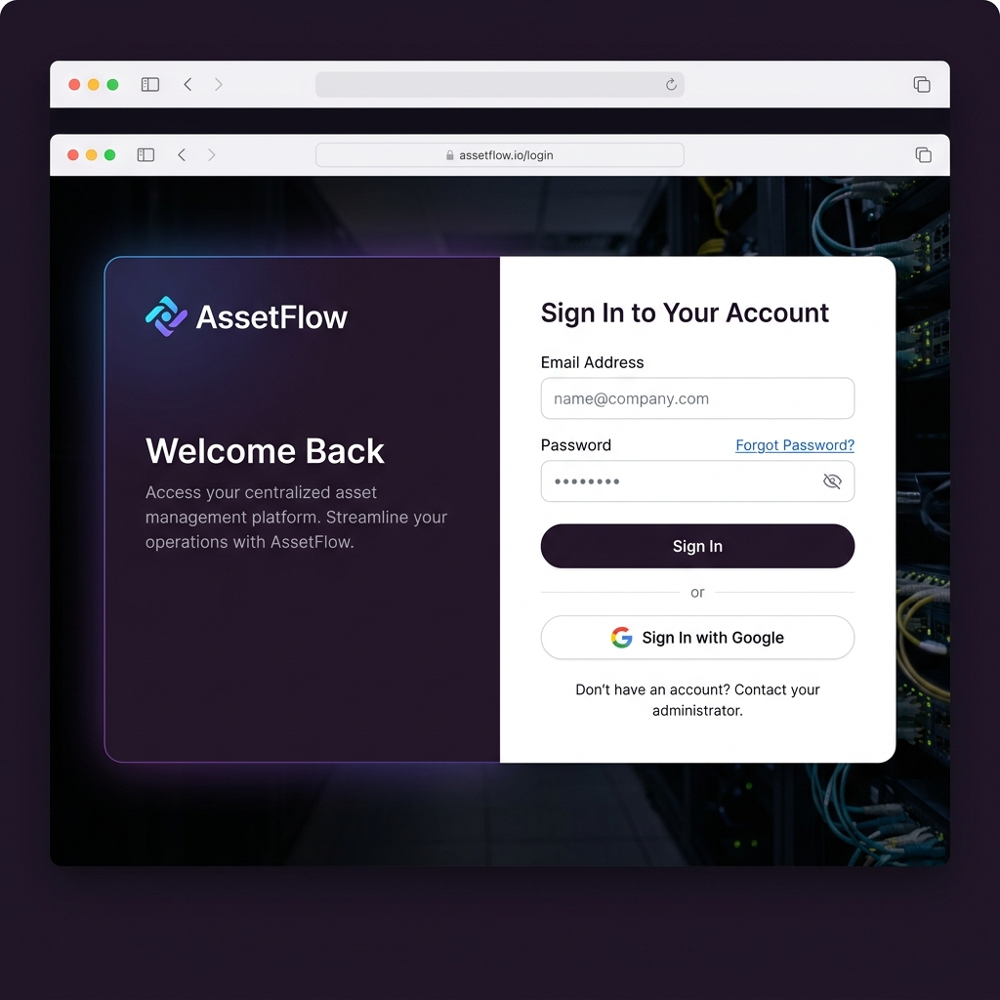
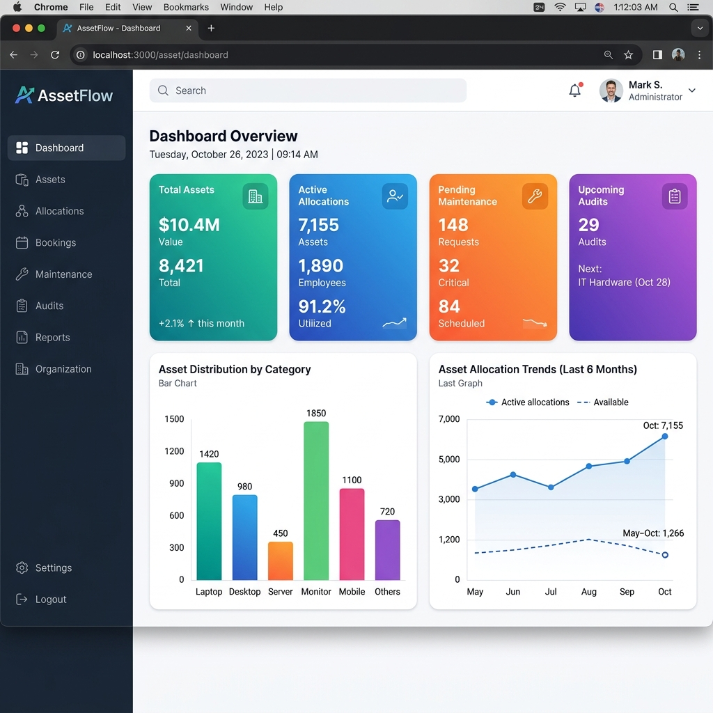
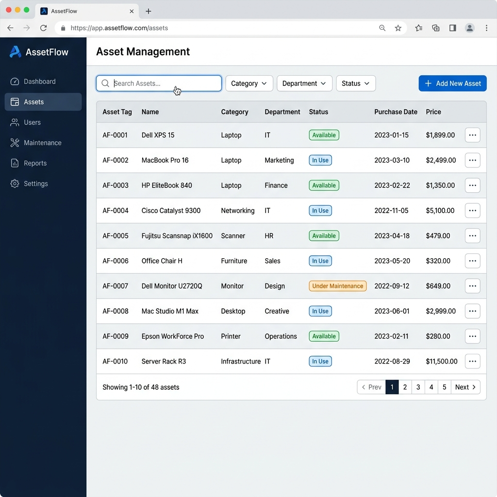

<p align="center">
  
</p>

<h1 align="center">🏢 AssetFlow — Enterprise Asset & Resource Management System</h1>

<p align="center">
  <strong>A full-stack, production-ready platform for enterprise asset lifecycle management, resource booking, maintenance tracking, and compliance auditing.</strong>
</p>

<p align="center">
  
  
  
  
  
  
</p>

<p align="center">
  <a href="#-features">Features</a> •
  <a href="#-screenshots">Screenshots</a> •
  <a href="#-tech-stack">Tech Stack</a> •
  <a href="#-architecture">Architecture</a> •
  <a href="#-getting-started">Getting Started</a> •
  <a href="#-api-documentation">API Docs</a> •
  <a href="#-contributing">Contributing</a>
</p>

---

## 📸 Screenshots

<p align="center">
  
  <br />
  <em>📊 Interactive Dashboard — Real-time KPIs, asset distribution charts, and allocation trends</em>
</p>

<br />

<p align="center">
  
  <br />
  <em>📦 Asset Management — Full CRUD with search, filters, status badges, and pagination</em>
</p>

<br />

<p align="center">
  
  <br />
  <em>🔐 Secure Authentication — Email/Password + Google OAuth 2.0 with video background</em>
</p>

---

## ✨ Features

### 🔐 Authentication & Security
| Feature | Description |
|---------|-------------|
| **JWT Authentication** | Stateless token-based auth with secure HTTP-only cookies |
| **Google OAuth 2.0** | One-click sign-in/sign-up via Google accounts |
| **Role-Based Access Control** | 4 roles: `ADMIN`, `DEPARTMENT_HEAD`, `ASSET_MANAGER`, `EMPLOYEE` |
| **Email OTP Verification** | 6-digit OTP sent via email for account verification |
| **Forgot Password** | 6-digit reset code with 15-minute expiry |
| **Auto Admin Seeding** | Default admin account (`admin@assetflow.com`) created on startup |

### 📦 Asset Management
| Feature | Description |
|---------|-------------|
| **Full CRUD Operations** | Create, read, update, and delete company assets |
| **Asset Categorization** | Organize by categories (Electronics, Furniture, Vehicles, etc.) |
| **Status Tracking** | Real-time status: `AVAILABLE`, `IN_USE`, `UNDER_MAINTENANCE`, `DISPOSED` |
| **Asset Tags** | Unique auto-generated identifiers for every asset |
| **Department Assignment** | Assign assets to specific departments |

### 👥 Asset Allocation
| Feature | Description |
|---------|-------------|
| **Employee Assignment** | Allocate assets to employees with condition tracking |
| **Return Processing** | Process returns with condition-on-return documentation |
| **Allocation History** | Complete audit trail of all allocations |
| **Status Workflows** | `ALLOCATED` → `RETURNED` lifecycle tracking |

### 📅 Resource Booking
| Feature | Description |
|---------|-------------|
| **Room & Vehicle Booking** | Employees can book shared rooms, vehicles, and equipment |
| **Time Slot Management** | Date and time-based booking with conflict prevention |
| **Booking Status** | `PENDING` → `APPROVED` → `COMPLETED` / `CANCELLED` workflows |
| **Zero-Overlap Engine** | Prevents double-booking of the same resource |

### 🔧 Maintenance Management
| Feature | Description |
|---------|-------------|
| **Ticket System** | Log maintenance requests against specific assets |
| **Priority Levels** | `LOW`, `MEDIUM`, `HIGH`, `CRITICAL` priority classification |
| **Status Tracking** | `REQUESTED` → `IN_PROGRESS` → `COMPLETED` / `CANCELLED` |
| **Cost Tracking** | Record maintenance costs for budgeting and reporting |

### 📋 Audit & Compliance
| Feature | Description |
|---------|-------------|
| **Audit Cycles** | Schedule and manage periodic asset audit cycles |
| **Condition Check-Ins** | Verify physical condition of assets during audits |
| **Compliance Reports** | Generate audit reports for regulatory compliance |

### 📊 Dashboard & Analytics
| Feature | Description |
|---------|-------------|
| **Real-Time KPIs** | Total assets, active allocations, pending maintenance, audit status |
| **Visual Charts** | Bar charts, line graphs, and pie charts powered by Recharts |
| **Department Analytics** | Asset distribution across departments |
| **Trend Analysis** | Historical allocation and maintenance trends |

### 🏗️ Organization Management
| Feature | Description |
|---------|-------------|
| **Department CRUD** | Create, update, and delete departments |
| **Team Management** | View and manage employees within departments |
| **Role Promotion** | Admins can promote employees to higher roles |

---

## 🛠️ Tech Stack

### Backend
| Technology | Purpose |
|-----------|---------|
| **Java 17** | Core language |
| **Spring Boot 3.2.5** | Application framework |
| **Spring Security** | Authentication & authorization |
| **Spring Data JPA** | ORM & database access |
| **JWT (JSON Web Tokens)** | Stateless authentication |
| **MySQL 8.0** | Relational database |
| **Springdoc OpenAPI** | API documentation (Swagger UI) |
| **JavaMailSender** | Email OTP delivery |
| **Maven** | Build & dependency management |

### Frontend
| Technology | Purpose |
|-----------|---------|
| **React 19** | UI component library |
| **Vite 6** | Build tool & dev server |
| **Tailwind CSS v4** | Utility-first CSS framework |
| **Zustand** | Global state management |
| **React Router v7** | Client-side routing |
| **Recharts** | Data visualization |
| **Lucide React** | Icon library |
| **Axios** | HTTP client |
| **@react-oauth/google** | Google OAuth integration |
| **QRCode.react** | QR code generation for assets |

---

## 🏗️ Architecture

```
┌──────────────────────────────────────────────────────────┐
│                      CLIENT (Browser)                     │
│                                                           │
│  React 19 + Vite + Tailwind CSS + Zustand                │
│  ┌─────────┐  ┌──────────┐  ┌───────────┐  ┌──────────┐ │
│  │  Auth   │  │Dashboard │  │  Assets   │  │ Bookings │ │
│  │  Pages  │  │  Module  │  │  Module   │  │  Module  │ │
│  └────┬────┘  └────┬─────┘  └─────┬─────┘  └────┬─────┘ │
│       └─────────────┴──────────────┴─────────────┘       │
│                         │ Axios (REST)                    │
└─────────────────────────┼────────────────────────────────┘
                          │  HTTP/HTTPS (JWT Bearer Token)
┌─────────────────────────┼────────────────────────────────┐
│                    BACKEND (Spring Boot)                   │
│                         │                                 │
│  ┌──────────────────────▼────────────────────────────┐   │
│  │              Security Filter Chain                 │   │
│  │        (JWT Validation + CORS + RBAC)             │   │
│  └──────────────────────┬────────────────────────────┘   │
│                         │                                 │
│  ┌──────────┐  ┌────────┴──────┐  ┌──────────────────┐  │
│  │Controllers│  │   Services    │  │   Repositories   │  │
│  │ (REST API)│──│(Business Logic)│──│  (Spring Data)   │  │
│  └──────────┘  └───────────────┘  └────────┬─────────┘  │
│                                             │            │
└─────────────────────────────────────────────┼────────────┘
                                              │ JPA/Hibernate
                                    ┌─────────▼──────────┐
                                    │    MySQL Database   │
                                    │                     │
                                    │  Users, Assets,     │
                                    │  Departments,       │
                                    │  Allocations,       │
                                    │  Bookings,          │
                                    │  Maintenance,       │
                                    │  Audit Cycles       │
                                    └─────────────────────┘
```

---

## 🚀 Getting Started

### Prerequisites

Ensure the following are installed on your machine:

| Tool | Version | Download |
|------|---------|----------|
| **Java JDK** | 17+ | [Download](https://www.oracle.com/java/technologies/javase/jdk17-archive-downloads.html) |
| **Node.js** | 18+ | [Download](https://nodejs.org/) |
| **Maven** | 3.8+ | [Download](https://maven.apache.org/download.cgi) |
| **MySQL** | 8.0+ | [Download](https://dev.mysql.com/downloads/mysql/) |
| **Git** | Latest | [Download](https://git-scm.com/) |

### 1️⃣ Clone the Repository

```bash
git clone https://github.com/manishworkss/Assetflow-Odoo.git
cd Assetflow-Odoo
```

### 2️⃣ Database Setup

Create a MySQL database:

```sql
CREATE DATABASE assetflow_db;
```

### 3️⃣ Backend Configuration

Edit `src/main/resources/application.properties`:

```properties
# Database
spring.datasource.url=jdbc:mysql://localhost:3306/assetflow_db
spring.datasource.username=your_username
spring.datasource.password=your_password
spring.jpa.hibernate.ddl-auto=update

# JWT
jwt.secret=your_jwt_secret_key
jwt.expiration=86400000

# Google OAuth
google.client.id=your_google_client_id

# Email (for OTP)
spring.mail.host=smtp.gmail.com
spring.mail.port=587
spring.mail.username=your_email@gmail.com
spring.mail.password=your_app_password
```

### 4️⃣ Start the Backend

```bash
mvn clean spring-boot:run
```

The backend API will be available at `http://localhost:8080`

### 5️⃣ Frontend Configuration

Create/update `Frontend/.env.development`:

```env
VITE_USE_MOCK=false
VITE_API_BASE_URL=/api
VITE_GOOGLE_CLIENT_ID=your_google_client_id.apps.googleusercontent.com
```

### 6️⃣ Start the Frontend

```bash
cd Frontend
npm install
npm run dev
```

The frontend will be available at `http://localhost:5173`

### 7️⃣ Default Admin Login

On first startup, the system automatically creates a default admin account:

| Field | Value |
|-------|-------|
| **Email** | `admin@assetflow.com` |
| **Password** | `admin123` |

> ⚠️ **Important:** Change the default admin password immediately after first login.

---

## 📖 API Documentation

### Swagger UI

Once the backend is running, access the interactive API documentation:

- **Swagger UI:** [http://localhost:8080/swagger-ui/index.html](http://localhost:8080/swagger-ui/index.html)
- **OpenAPI Spec:** [http://localhost:8080/v3/api-docs](http://localhost:8080/v3/api-docs)

### Key API Endpoints

<details>
<summary><strong>🔐 Authentication</strong></summary>

| Method | Endpoint | Description |
|--------|----------|-------------|
| `POST` | `/api/auth/signup` | Register new employee account |
| `POST` | `/api/auth/login` | Login with email/password |
| `POST` | `/api/auth/verify-otp` | Verify email with 6-digit OTP |
| `POST` | `/api/auth/resend-otp` | Resend OTP verification code |
| `POST` | `/api/auth/google` | Google OAuth sign-in |
| `POST` | `/api/auth/forgot-password` | Request password reset code |
| `POST` | `/api/auth/reset-password` | Reset password with token |

</details>

<details>
<summary><strong>📦 Assets</strong></summary>

| Method | Endpoint | Description |
|--------|----------|-------------|
| `GET` | `/api/assets` | List all assets |
| `GET` | `/api/assets/{id}` | Get asset by ID |
| `POST` | `/api/assets` | Create new asset |
| `PUT` | `/api/assets/{id}` | Update asset |
| `DELETE` | `/api/assets/{id}` | Delete asset |

</details>

<details>
<summary><strong>👥 Allocations</strong></summary>

| Method | Endpoint | Description |
|--------|----------|-------------|
| `GET` | `/api/allocations` | List all allocations |
| `POST` | `/api/allocations` | Create allocation |
| `PUT` | `/api/allocations/{id}/return` | Process asset return |

</details>

<details>
<summary><strong>📅 Bookings</strong></summary>

| Method | Endpoint | Description |
|--------|----------|-------------|
| `GET` | `/api/bookings` | List all bookings |
| `POST` | `/api/bookings` | Create booking |
| `PUT` | `/api/bookings/{id}/status` | Update booking status |

</details>

<details>
<summary><strong>🔧 Maintenance</strong></summary>

| Method | Endpoint | Description |
|--------|----------|-------------|
| `GET` | `/api/maintenance` | List maintenance requests |
| `POST` | `/api/maintenance` | Create maintenance request |
| `PUT` | `/api/maintenance/{id}` | Update maintenance request |

</details>

<details>
<summary><strong>📋 Audits</strong></summary>

| Method | Endpoint | Description |
|--------|----------|-------------|
| `GET` | `/api/audits` | List audit cycles |
| `POST` | `/api/audits` | Create audit cycle |
| `PUT` | `/api/audits/{id}` | Update audit cycle |

</details>

<details>
<summary><strong>🏢 Departments</strong></summary>

| Method | Endpoint | Description |
|--------|----------|-------------|
| `GET` | `/api/departments` | List all departments |
| `POST` | `/api/departments` | Create department |
| `PUT` | `/api/departments/{id}` | Update department |
| `DELETE` | `/api/departments/{id}` | Delete department |

</details>

<details>
<summary><strong>📊 Dashboard</strong></summary>

| Method | Endpoint | Description |
|--------|----------|-------------|
| `GET` | `/api/dashboard/stats` | Get dashboard statistics |

</details>

---

## 🏗️ Project Structure

```text
Assetflow-Odoo/
│
├── 📂 Frontend/                          # React + Vite Application
│   ├── 📂 src/
│   │   ├── 📂 api/                       # API client & service layers
│   │   │   ├── client.js                 # Axios instance with interceptors
│   │   │   └── services/                 # Feature-specific API services
│   │   │       ├── authService.js        # Auth endpoints
│   │   │       ├── assetService.js       # Asset CRUD
│   │   │       ├── allocationService.js  # Allocation management
│   │   │       ├── bookingService.js     # Resource bookings
│   │   │       ├── maintenanceService.js # Maintenance requests
│   │   │       ├── auditService.js       # Audit cycles
│   │   │       ├── dashboardService.js   # Dashboard stats
│   │   │       └── ...
│   │   ├── 📂 components/                # Reusable UI components
│   │   │   ├── common/                   # Buttons, Modals, Tables
│   │   │   └── layout/                   # Sidebar, Header, AppLayout
│   │   ├── 📂 features/                  # Feature modules
│   │   │   ├── auth/                     # Login, Signup, OTP Verification
│   │   │   ├── dashboard/               # Dashboard & Analytics
│   │   │   ├── assets/                  # Asset Management
│   │   │   ├── allocations/             # Asset Allocation
│   │   │   ├── bookings/               # Resource Booking
│   │   │   ├── maintenance/            # Maintenance Tickets
│   │   │   ├── audits/                 # Audit Cycles
│   │   │   ├── reports/                # Reports & Export
│   │   │   ├── organization/           # Department & Team Setup
│   │   │   └── notifications/          # Notification Center
│   │   ├── 📂 store/                     # Zustand state management
│   │   │   ├── authStore.js             # Auth state & JWT
│   │   │   └── uiStore.js              # UI state (toasts, modals)
│   │   ├── App.jsx                      # Root component & routing
│   │   └── main.jsx                     # Entry point
│   ├── .env.development                 # Environment variables
│   ├── vite.config.js                   # Vite configuration (proxy)
│   └── package.json                     # Node dependencies
│
├── 📂 src/main/java/com/assetflow/backend/  # Spring Boot Application
│   ├── 📂 config/                        # Configuration classes
│   │   ├── SecurityConfig.java          # Spring Security + JWT filter
│   │   ├── CorsConfig.java             # CORS configuration
│   │   └── DataInitializer.java         # Seed departments + admin user
│   ├── 📂 controller/                    # REST API controllers
│   │   ├── AuthController.java          # Authentication endpoints
│   │   ├── AssetController.java         # Asset CRUD endpoints
│   │   ├── AllocationController.java    # Allocation endpoints
│   │   ├── BookingController.java       # Booking endpoints
│   │   ├── MaintenanceController.java   # Maintenance endpoints
│   │   ├── AuditController.java         # Audit endpoints
│   │   ├── DashboardController.java     # Dashboard stats endpoint
│   │   └── ...
│   ├── 📂 dto/                           # Data Transfer Objects
│   ├── 📂 entity/                        # JPA Entities (DB tables)
│   │   ├── User.java
│   │   ├── Asset.java
│   │   ├── Department.java
│   │   ├── AssetAllocation.java
│   │   ├── ResourceBooking.java
│   │   ├── MaintenanceRequest.java
│   │   ├── AuditCycle.java
│   │   └── Category.java
│   ├── 📂 enums/                         # Status enumerations
│   │   ├── Role.java                    # ADMIN, DEPARTMENT_HEAD, etc.
│   │   ├── AssetStatus.java             # AVAILABLE, IN_USE, etc.
│   │   └── ...
│   ├── 📂 exception/                     # Global exception handling
│   ├── 📂 repository/                    # Spring Data JPA repositories
│   ├── 📂 security/                      # JWT utility & filters
│   ├── 📂 service/                       # Business logic layer
│   │   ├── impl/                        # Service implementations
│   │   └── EmailService.java            # Email/OTP service
│   └── BackendApplication.java          # Main Spring Boot entry point
│
├── 📂 docs/images/                       # Documentation images
├── pom.xml                               # Maven dependencies
└── README.md                             # This file
```

---

## 👥 Role-Based Access Control (RBAC)

| Role | Permissions |
|------|------------|
| **ADMIN** | Full system access. Manage users, departments, all assets, and system settings. |
| **DEPARTMENT_HEAD** | Manage assets and employees within their department. Approve bookings. |
| **ASSET_MANAGER** | Create, update, and manage all assets. Handle allocations and maintenance. |
| **EMPLOYEE** | View assigned assets, create booking requests, raise maintenance tickets. |

> 🔑 New users signing up (via form or Google) are assigned the `EMPLOYEE` role by default. Only an `ADMIN` can promote users to higher roles.

---

## 🤝 Contributing

We welcome contributions! Here's how to get started:

1. **Fork** the repository
2. **Create** a feature branch: `git checkout -b feature/amazing-feature`
3. **Commit** your changes: `git commit -m 'Add amazing feature'`
4. **Push** to the branch: `git push origin feature/amazing-feature`
5. **Open** a Pull Request

### Code Style Guidelines

- **Backend:** Follow standard Java/Spring conventions
- **Frontend:** Use functional components with hooks, Tailwind utility classes
- **Commits:** Use [Conventional Commits](https://www.conventionalcommits.org/) format

---

## 📄 License

This project is built for the **Odoo Combat Hackathon 2026**. All rights reserved.

---

<p align="center">
  <strong>Built with ❤️ by the AssetFlow Team</strong>
  <br />
  <a href="https://github.com/manishworkss/Assetflow-Odoo">⭐ Star this repo</a> •
  <a href="https://github.com/manishworkss/Assetflow-Odoo/issues">🐛 Report Bug</a> •
  <a href="https://github.com/manishworkss/Assetflow-Odoo/issues">💡 Request Feature</a>
</p>
